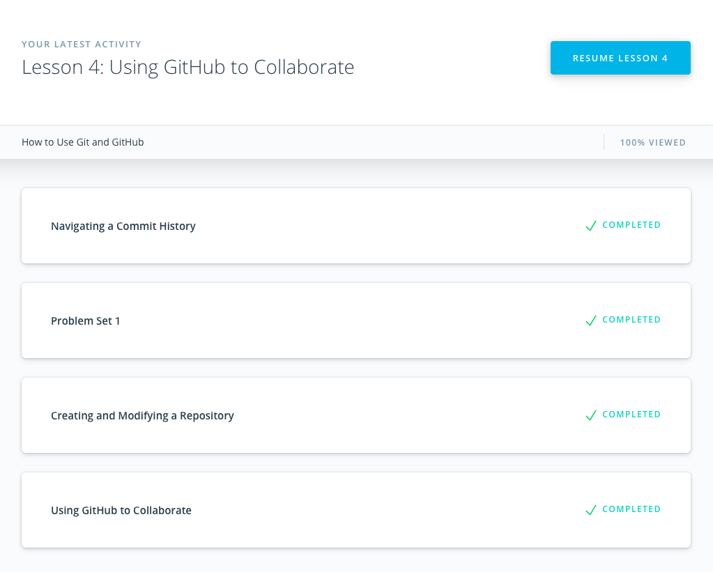

# Kottans frontend

## 0 - Git and GitHub

Git is a powerful tool of every developer, it makes life easier and saves time. Git simplifies work with version control, provides easy access to history of changes, it can remove fear of irreparable consequences that allow us to experiment with program, gives us opportunity to collaborate, share projects with other people and a lot more.

Course on Udacity had a great educational impact on me, a big pros that it showed different real situations and how they are handeled with Git. Were studied main concepts like commits, staging area, remote repository, branches and GitHub collaboration principles. Important idea of commiting is to understand not only how make a commit but why and how often.

## 1 - Linux CLI, and HTTP

Command line skills are usefull to operate with file directories, every action performed using GUI can be acomplished by line of code in CLI, this allows us to work faster and be ready to situation when graphical interface don't even exist. Also understanding of CLI is crucial to work with Git. Main concepts that I've learned are directory navigating commands like: pwd, ls, cd, mkdir, mv; files operating commands: touch, sort, uniq, grep, sed; output/input redirection commands: cat, >, >>, <, |; and scripting concept that allows us to code frequently used commands.

Articles about HTTP were informative and provided general overview about protocol, headers, client-server communication and was explained the meaning of status codes. The second part of article introduced more detailed information about http connections, namely process of user indentification and authentication, secure protocol and certificates and concept of caching that saves time, cost and improve web-browsing experience. Though text appeared to me a bit tough, I've fixed the result with CS50 lecture about HTTP.

## 2 - Git Collaboration

This two completed courses, in fact, it's just repetition of earlier covered material with useful additions and some new Git features.
What was learned new: 
* Flags, that used to alter how a program functions and/or what is displayed. For example -p, --stat, --oneline, --decorate, --graph, --all for git log. This flags helps us to get more info about commits and operate with it in more convinient way;
* git show, to access info about particular commit and how it can be reached by HEAD reference;
* git tag, to label commits;
* git commit --amend, useful command to "cancel" most recent commit, allows us to add some files to staging area or change the commit message;
* git reset --soft(resets commit) --mixed(resets commit+index) --hard(resets commit+index+working area);
* git shortlog provides more clear view on commits history;
* Was introduced upstream, that helps us keep up to date our forked repository with original one;
* And at the end was reviewed powerful git rebase, that provides us ability to change past commits, for example rename, squash, delete and a lot more.   

